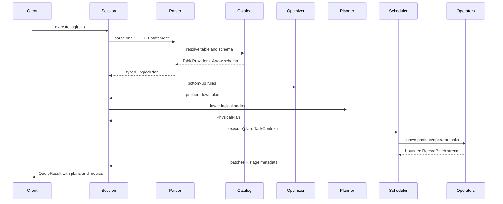
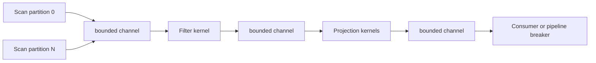
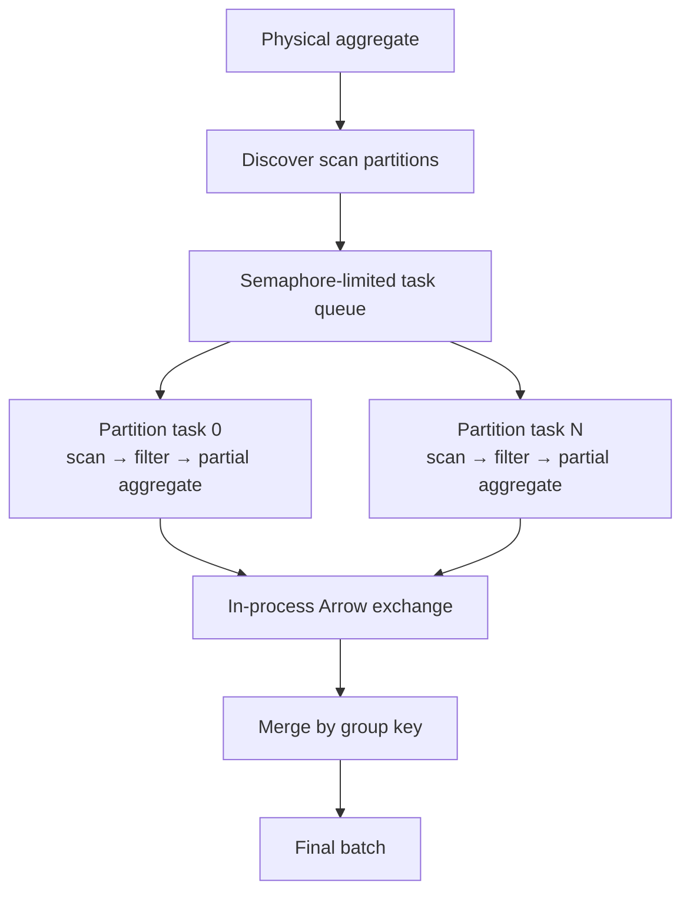
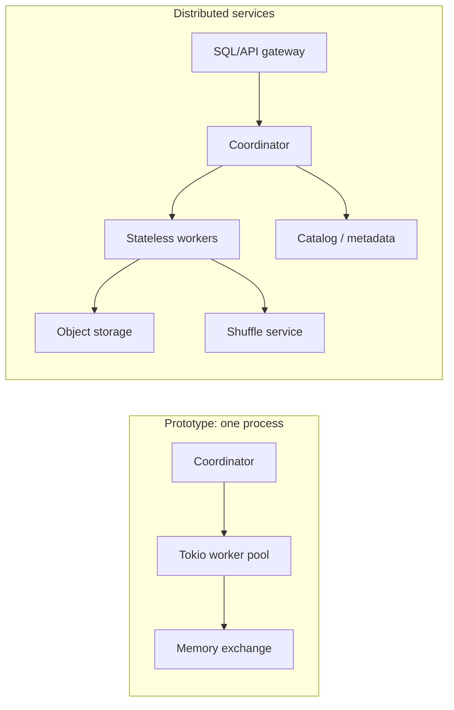

# SparkX high-level design

## Scope

SparkX is a single-node vectorized engine plus a transport-free distributed execution prototype. The control plane parses, validates, optimizes, fragments, and schedules. The data plane scans Arrow batches, evaluates kernels, moves bounded streams between operators, and materializes only at pipeline breakers.

The current design is intentionally compact enough for one person to trace in a debugger.

## System context


## Query lifecycle



### 1. SQL frontend and analysis

`Session::sql` uses `sqlparser` for syntax and owns semantic lowering. It resolves the `FROM` source through the catalog, carries the provider's Arrow schema through every logical node, translates SQL expressions into the engine expression tree, and rejects unsupported features early.

The result is an immutable `LogicalPlan`:

```text
Limit
  Sort
    Projection
      Aggregate
        Filter
          Scan
```

Schemas are attached to plan nodes. That gives planning-time column validation and makes the physical planner mechanical.

### 2. Catalog and storage adapters

The `TableProvider` trait is the storage boundary:

- `schema()` exposes the Arrow contract.
- `partition_count()` tells the scheduler how much scan parallelism exists.
- `estimated_bytes()` feeds metrics today and cost estimation later.
- `scan_partition(partition, projection, batch_size)` returns columnar batches.

`MemoryTable` is the deterministic testing/programmatic source. `CsvTable` infers a schema and streams one file partition. `ParquetTable` maps each row group to a scan partition and applies root-column projection at the reader.

Future object-store and Iceberg/Delta adapters implement this trait without changing the operator layer.

### 3. Logical optimizer

The optimizer recursively normalizes children and applies three rule families:

1. Expressions are simplified with constant folding, Boolean identities, and typed null propagation.
2. A `Filter` directly above a `Scan` becomes a scan filter.
3. A `Projection` directly above a `Scan` computes the union of output and filter columns, then installs a scan projection.

Filters are currently executed by SparkX after reading a batch; the pushdown annotation is already positioned for Parquet row-group/page pruning later. The optimizer is deterministic, has no statistics, and preserves a readable before/after plan.

### 4. Physical planning

The physical planner resolves scan column names to provider indices and lowers each logical node one-for-one:

| Logical node | Physical operator | Streaming? |
|---|---|---|
| Scan | Partitioned scan | Yes |
| Projection | Arrow expression projection | Yes |
| Filter | Boolean mask | Yes |
| Aggregate | Hash aggregate | No; pipeline breaker |
| Sort | Lexicographic sort | No; pipeline breaker |
| Limit | Row-budget slicer | Yes |
| Join | Build/probe hash join | No; pipeline breaker |

The output is an immutable `Arc<PhysicalPlan>`, so worker tasks can safely share it.

### 5. Native execution engine



Every streaming operator owns a Tokio task and communicates through an `mpsc` channel sized by `channel_capacity`. If a consumer is slower, `send().await` blocks its producer: memory is bounded by batch size times live channel capacity rather than input size.

Scans run partitions concurrently. Expressions dispatch to Arrow comparison, boolean, numeric, cast, filter, take, concatenation, and sort kernels. Operators pass `RecordBatch` values rather than rows.

Pipeline breakers collect their input:

- Hash aggregate stores one state vector per grouping key.
- Sort concatenates batches and produces global lexicographic indices.
- Hash join builds a key-to-row-index map on the right, then emits matched (or left-null-extended) rows.

### 6. Local distributed execution

The cluster path is used when a physical plan ends in a hash aggregate over a multi-partition, non-join input.



Stage 1 executes one task per source partition, limited by the configured worker count. Each task produces partial states:

| Aggregate | Partial state | Final merge |
|---|---|---|
| COUNT | count | sum counts |
| SUM | floating sum | sum partial sums |
| MIN | candidate | minimum candidate |
| MAX | candidate | maximum candidate |
| AVG | sum + count | total sum / total count |

Stage 2 groups partial Arrow rows and merges them. `shuffled_rows` records the size of this exchange. Unsupported distributed shapes—including distinct aggregates, which need a set-aware exchange—intentionally fall back to native execution and report `distributed = false`; they do not silently pretend to be distributed.

### 7. Observability and query result

Each query receives a shared `QueryMetrics` context. Scans and tasks update input rows/batches,
estimated bytes, task count, and shuffle rows. The session records output rows/batches and
wall-clock nanoseconds. `QueryResult` also preserves all three plan texts and runner/stage metadata.

The physical planner assigns deterministic pre-order IDs (`LimitExec#0`, `SortExec#1`, and so on).
Every operator records emitted rows/batches and elapsed nanoseconds under its ID; repeated
partition attempts aggregate into the same operator entry. A production version would add input
and peak-memory counters, histograms, spill bytes, remote fetch time, and OpenTelemetry spans.

## Core invariants

- A plan node's declared schema matches every batch it emits.
- Expressions are type-checked against the input schema before execution.
- Scan partitions are independent and may execute in any order.
- Bounded channels are the only streaming handoff.
- Aggregate partials are mergeable using the same logical semantics.
- An error closes the affected stream and is returned to the session.
- The runner reports whether distribution actually occurred.
- Physical operator IDs are deterministic for the same optimized plan.

## Failure and cancellation model

Today, Arrow/I/O/planning/task errors propagate as `SparkXError`. A public, cloneable
`CancellationToken` can be supplied through `execute_sql_with_cancellation` or
`execute_plan_with_cancellation`; native operators and local distributed tasks observe it and
return `SparkXError::Cancelled`. Cancellation is cooperative: a blocking storage read already in
progress cannot be interrupted, but its stream is detached and its eventual output is discarded.
Worker tasks are not retried, shuffle is not durable, and there is no coordinator recovery.

The production design adds deadlines, remote cancellation propagation, task attempt IDs,
idempotent output commits, worker heartbeats, bounded retries, and durable/recomputable shuffle
blocks.

## Deployment shape: now and next



The seam to replace is `LocalCluster`: fragment the physical plan at exchange boundaries, serialize fragments, send them through Arrow Flight/gRPC, and make the current per-partition execution entry point the worker RPC handler.

## Non-goals for version 0.1

- Full SQL compatibility
- Distributed joins or global distributed sort
- Durable shuffle, retry, or speculative execution
- Cost-based join ordering
- Spill-to-disk memory safety
- Multi-tenant admission control and security
- Production compatibility guarantees

These are roadmap work, not implied features.
