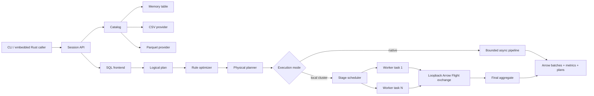
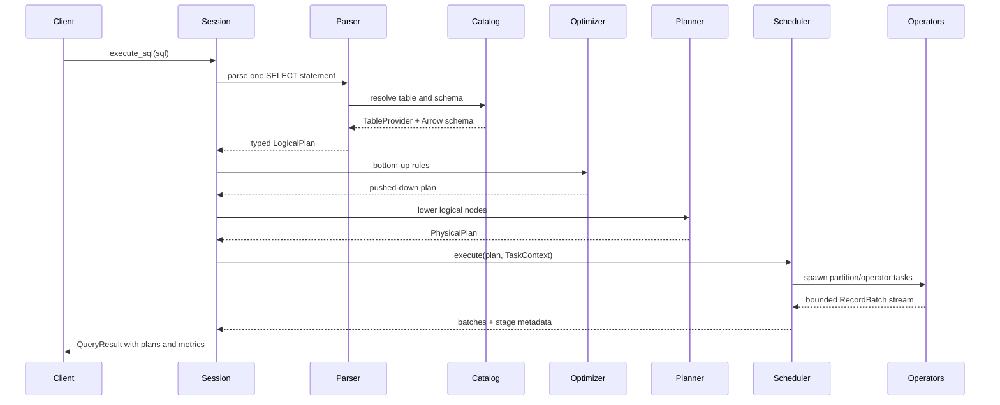
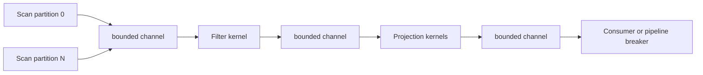
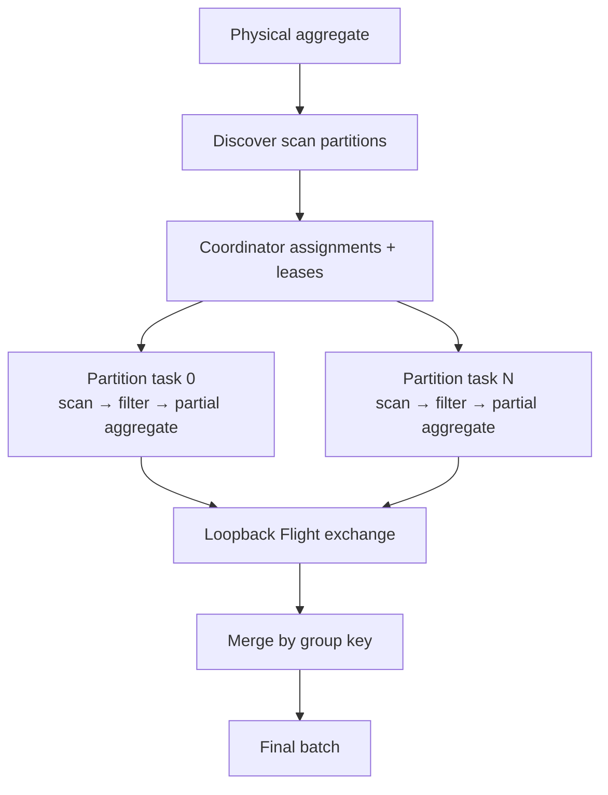
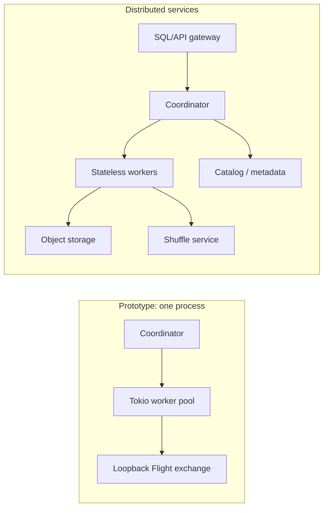

# SparkX high-level design

## Scope

SparkX is a single-node vectorized engine plus an in-process distributed execution prototype with Arrow Flight/gRPC control- and data-plane transports. The control plane parses, validates, optimizes, fragments, and schedules. The data plane scans Arrow batches, evaluates kernels, moves bounded streams between operators, and materializes only at pipeline breakers.

The current design is intentionally compact enough for one person to trace in a debugger.

## System context



## Query lifecycle



### 1. SQL frontend and analysis

`Session::sql` uses `sqlparser` for syntax and owns semantic lowering. It resolves the `FROM` source through the catalog, carries the provider's Arrow schema through every logical node, translates SQL expressions into the engine expression tree, and rejects unsupported features early.

The result is an immutable `LogicalPlan`:

```text
Limit
  Sort
    Projection
      Aggregate
        Filter
          Scan
```

Schemas are attached to plan nodes. That gives planning-time column validation and makes the physical planner mechanical.

### 2. Catalog and storage adapters

The `TableProvider` trait is the storage boundary:

- `schema()` exposes the Arrow contract.
- `partition_count()` tells the scheduler how much scan parallelism exists.
- `estimated_bytes()` feeds metrics today and cost estimation later.
- `partition_may_match(partition, filters)` allows conservative metadata pruning before I/O.
- `scan_partition(partition, projection, batch_size)` returns columnar batches.

`MemoryTable` is the deterministic testing/programmatic source. `CsvTable` infers a schema and streams one file partition. `ParquetTable` maps each row group to a scan partition, applies root-column projection at the reader, and skips row groups that exact min/max/null statistics prove cannot satisfy pushed filters.

Future object-store and Iceberg/Delta adapters implement this trait without changing the operator layer.

### 3. Logical optimizer

The optimizer recursively normalizes children and applies three rule families:

1. Expressions are simplified with constant folding, Boolean identities, and typed null propagation.
2. A `Filter` directly above a `Scan` becomes a scan filter.
3. A `Projection` directly above a `Scan` computes the union of output and filter columns, then installs a scan projection.

Filters are still evaluated by SparkX after reading a batch for correctness. Before I/O, providers may also use the pushed annotation conservatively: Parquet prunes impossible row groups from footer statistics, while unknown expressions remain scannable. Page and bloom-filter pruning remain open. The optimizer itself is deterministic, has no statistics, and preserves a readable before/after plan.

### 4. Physical planning

The physical planner resolves scan column names to provider indices and lowers each logical node one-for-one:

| Logical node | Physical operator | Streaming? |
|---|---|---|
| Scan | Partitioned scan | Yes |
| Projection | Arrow expression projection | Yes |
| Filter | Boolean mask | Yes |
| Aggregate | Hash aggregate | No; pipeline breaker |
| Sort | Lexicographic sort | No; pipeline breaker |
| Top-K | Limited lexicographic sort | No; pipeline breaker |
| Limit | Row-budget slicer | Yes |
| Join | Build/probe hash join | No; pipeline breaker |

The output is an immutable `Arc<PhysicalPlan>`, so worker tasks can safely share it.

### 5. Native execution engine



Every streaming operator owns a Tokio task and communicates through an `mpsc` channel sized by `channel_capacity`. If a consumer is slower, `send().await` blocks its producer: memory is bounded by batch size times live channel capacity rather than input size.

Scans run partitions concurrently. Expressions dispatch to Arrow comparison, boolean, numeric, cast, filter, take, concatenation, and sort kernels. Operators pass `RecordBatch` values rather than rows.

Pipeline breakers collect their input:

- Hash aggregate encodes evaluated group columns into Arrow's comparable row format and stores one state vector per byte key.
- Sort concatenates batches and produces global lexicographic indices.
- Top-K also concatenates its input, but uses Arrow's limited sort and materializes only the best `K` rows. Its current index workspace may still scale with input size.
- Hash join uses the same encoded row format for build/probe keys, skips keys containing SQL `NULL`, then emits matched (or left-null-extended) rows.

Each task context carries a query-scoped memory manager. Buffered pipeline-breaker input, aggregate
and join hash state, full-sort or Top-K index working sets, and local-distributed partial/shuffle state acquire RAII
reservations against the configured byte limit. Arrow batches use their reported allocation size;
Rust hash structures use conservative retained-value estimates. Exceeding the limit returns
`SparkXError::ResourceExhausted`, and dropping a reservation returns its bytes. Spill files and
pressure callbacks remain future work.

The shared row-key encoder converts key columns once per batch, hashes compact encoded bytes, and
decodes group keys directly back into Arrow arrays. Temporary encoded batches and retained byte
keys both participate in query memory accounting. The local-distributed final merge uses the same
encoding as native aggregation, avoiding per-row `Vec<ScalarValue>` key construction in all three
hash paths.

### 6. Local distributed execution

The cluster path is used when a physical plan ends in a hash aggregate over a multi-partition, non-join input. Before tasks start, the worker input is encoded into a versioned Protobuf `StagePlan` and submitted to the coordinator. Each assigned task decodes its own fragment through the worker catalog. This removes reliance on sharing the coordinator's in-memory plan object, even though the workers still run in the same process.



Stage 1 executes one task per source partition, limited by the configured worker count. Each task produces partial states:

| Aggregate | Partial state | Final merge |
|---|---|---|
| COUNT | count | sum counts |
| SUM | floating sum | sum partial sums |
| MIN | candidate | minimum candidate |
| MAX | candidate | maximum candidate |
| AVG | sum + count | total sum / total count |

Each partial batch is Arrow-encoded by a Flight client, sent through gRPC to a query-scoped server on an ephemeral loopback port, echoed through `DoExchange`, and decoded before stage 2 groups and merges it. `shuffled_rows` and `shuffled_bytes` record the logical size of this exchange. The server is shut down with the query, and transport failures become query errors. Unsupported distributed shapes—including distinct aggregates, which need a set-aware exchange—intentionally fall back to native execution and report `distributed = false`; they do not silently pretend to be distributed.

The transport-neutral contracts in `protocol.rs` define versioned coordinator assignments and
worker registration, heartbeat, task-state, lease, cancellation, and immutable shuffle-block
messages. IDs and cross-message ownership are validated before use, and the contracts round-trip
through Serde. `StagePlan.plan_fragment` contains a versioned Protobuf physical plan supporting every
current physical operator and expression. Fragments are bounded to 16 MiB and 128 plan levels,
reject malformed or unsupported values, and carry explicit Arrow field contracts. Scan nodes contain
the catalog table name instead of a serialized `TableProvider`; decoding resolves that provider in the
worker catalog and rejects schema drift before execution.

`LocalCluster` registers one logical worker per configured slot and requests assignments from the
transport-independent `Coordinator`. Each Tokio worker decodes the assigned stage fragment through
its catalog, executes only the leased partition, and reports success, failure, or cancellation as a
validated worker message. The coordinator deterministically selects live workers, gates stages on
successful dependencies, leases partition attempts, requeues timed-out or
retryable attempts within a configured bound, validates task ownership, retains successful shuffle
blocks, and cancels query state. Heartbeat and lease deadlines are driven by caller-supplied timestamps,
which keeps the state machine deterministic in tests.

`control_plane.rs` hosts the state machine behind typed Arrow Flight `DoAction` calls. The service
accepts stage submissions, worker lifecycle messages, worker-specific assignment polls, task updates,
query cancellation, stage/partition status reads, and successful-stage output-manifest reads. Requests and responses are bounded to
96 MiB, validated before mutation, and
mapped to explicit gRPC status codes. Cancelling a query queues a control message for every worker
holding one of its leases, and polling returns those messages before new assignments. The coordinator
retains each cancelling lease and worker slot until the worker acknowledges cancellation or the
lease/heartbeat expires, preventing new work from overbooking a worker that is still stopping.

The local query runner does not connect through this service yet; its task handlers remain Tokio
closures in the same process. `RemoteWorker` provides the separate-process execution loop: it
registers resources, heartbeats with live slot/memory availability, polls worker-specific control
messages, decodes assigned plans against its local catalog, runs concurrent leased partitions under
shared memory accounting, and reports terminal states. The `sparkx-worker` CLI builds a CSV/Parquet
catalog from repeatable `--table NAME=PATH` arguments and shuts down cooperatively on Ctrl+C.

Each remote worker also binds a `data_plane.rs` Flight service. A completed task uploads its Arrow
batches with `DoPut`, then reports an immutable manifest containing the worker owner, advertised
endpoint, ticket, row/byte counts, and a CRC32 checksum. Consumers obtain successful-stage manifests
through the control client, fetch batches with `DoGet`, verify their metadata/checksum, and explicitly
delete consumed blocks. The store accounts retained Arrow bytes against a fixed capacity, rejects an
oversized streaming upload while decoding it, and preserves schemas for empty results. It is an
in-memory, worker-lifetime result sink—not durable shuffle—and currently has no authentication or TLS.

`RemoteStageRunner` is the first driver-side consumer of these services. It submits one prebuilt
`StagePlan`, polls explicit stage status, expands terminal failures with per-partition attempt errors,
propagates cancellation and timeout to the coordinator, downloads every output block, verifies a
consistent Arrow schema, and only then performs best-effort deletion. It deliberately does not claim
to fragment or merge an arbitrary SQL physical plan. `Session::execute_sql_remote` uses the runner for
the semantics-preserving partition-local subset (`Scan`, `Filter`, and `Projection`) and rejects every
global operator before submission. Aggregation, join, sort, and limit require multi-stage merge planning.

`sparkx-coordinator` hosts the same state and Flight service in a standalone process with configurable
bind address, lease duration, heartbeat timeout, attempt limit, and stage-partition limit. The local
runner still deliberately allows only one attempt until idempotent output commits are implemented, and
the `Session` driver does not yet orchestrate a remote stage graph or merge remote manifests.

### 7. Observability and query result

Each query receives a shared `QueryMetrics` context. Scans and tasks update input rows/batches,
estimated bytes, pruned partitions, task count, and shuffle rows. The session records output rows/batches and
wall-clock nanoseconds. `QueryResult` also preserves all three plan texts and runner/stage metadata.

The physical planner assigns deterministic pre-order IDs (`LimitExec#0`, `SortExec#1`, and so on).
Every operator records emitted rows/batches and elapsed nanoseconds under its ID; repeated
partition attempts aggregate into the same operator entry. Query metrics also report current and
peak reserved memory. A production version would add per-operator memory, histograms, spill bytes,
remote fetch time, and OpenTelemetry spans.

For remote SQL, the current driver snapshot records fetched output, transferred block bytes, task
count, and wall time. Worker-side scan/operator/memory metrics are not yet aggregated back into the
driver's `QueryResult`.

## Core invariants

- A plan node's declared schema matches every batch it emits.
- Expressions are type-checked against the input schema before execution.
- Scan partitions are independent and may execute in any order.
- Bounded channels are the only streaming handoff.
- Aggregate partials are mergeable using the same logical semantics.
- An error closes the affected stream and is returned to the session.
- The runner reports whether distribution actually occurred.
- Physical operator IDs are deterministic for the same optimized plan.

## Failure and cancellation model

Today, Arrow/I/O/planning/task errors propagate as `SparkXError`. A public, cloneable
`CancellationToken` can be supplied through `execute_sql_with_cancellation` or
`execute_plan_with_cancellation`; native operators and local distributed tasks observe it and
return `SparkXError::Cancelled`. Cancellation is cooperative: a blocking storage read already in
progress cannot be interrupted, but its stream is detached and its eventual output is discarded.
Transport failures are marked retryable by remote workers, but shuffle is not durable and there is no
coordinator recovery or complete retry commit protocol.

The protocol contracts now represent task attempts, leases, cancellation, heartbeats, and
recomputable shuffle-block metadata. The Flight control service queues cancellation for workers with
active leases; `RemoteWorker` polls those messages, cancels the matching task tokens, and acknowledges
the terminal state before its slot is released. The production runtime still needs deadlines,
idempotent output commits, bounded retries, durable storage, and coordinator recovery.

## Deployment shape: now and next



Physical-plan serialization, deterministic coordinator state, Flight control service, standalone
processes, a bounded worker-hosted Flight output sink, a single-stage remote driver, and partition-local
remote SQL now exist. The next step is to make `Session` fragment and submit global stage graphs, merge partial results, and repartition intermediate
blocks; durable/object-store shuffle follows that integration.

## Non-goals for version 0.1

- Full SQL compatibility
- Distributed joins or global distributed sort
- Durable shuffle, retry, or speculative execution
- Cost-based join ordering
- Spill-to-disk memory safety
- Multi-tenant admission control and security
- Production compatibility guarantees

These are roadmap work, not implied features.
