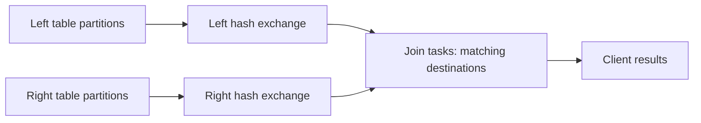

# Running remote joins

SparkX supports one inner or left equi-join with column keys of matching types. Inputs may use scans,
filters, and projections; output may use filters and projections. Compound keys and NULL semantics
are covered by the remote/native/DuckDB corpus in `tests/sql/remote_joins.sql`.



Both producers use the same destination count: the larger input partition count. Each downstream
task reads only its destination blocks from both inputs. Every producer publishes an empty block
with a schema for destinations without rows. The client collects results and deletes intermediate
and output blocks. SQL without ORDER BY makes no row-order promise.

## Four-terminal demo

Run these commands from the repository root. CSV inputs have one partition each, so this small demo
shows separate services but does not promise that both workers execute join tasks. The benchmark
below uses four partitions to exercise parallel scheduling.

Terminal 1:

```sh
cargo run --locked --bin sparkx-coordinator -- --bind 127.0.0.1:50051
```

Terminal 2:

```sh
cargo run --locked --bin sparkx-worker -- --worker-id worker-1 \
  --table orders=examples/data/orders.csv --table customers=examples/data/customers.csv
```

Terminal 3:

```sh
cargo run --locked --bin sparkx-worker -- --worker-id worker-2 \
  --table orders=examples/data/orders.csv --table customers=examples/data/customers.csv
```

Terminal 4:

```sh
cargo run --locked --bin sparkx -- --input examples/data/orders.csv --table orders \
  --register customers=examples/data/customers.csv \
  --sql "SELECT orders.order_id, customers.name, orders.amount FROM orders LEFT JOIN customers ON orders.customer_id = customers.customer_id" \
  --remote-coordinator http://127.0.0.1:50051 --metrics
```

Expected rows, in any order: `(1, Ada, 12)`, `(2, Grace, 30)`, `(3, Ada, 8)`, `(4, NULL, 50)`.
Every worker and the client must register compatible schemas and the same table contents/partitioning.

## Reproducible performance baseline

```sh
cargo run --locked --release --example remote_join_benchmark > join-baseline.jsonl
```

The example runs two loopback workers and a coordinator in one process, with 2,000 rows per table,
four partitions per table, and three native/remote iterations per distribution. Uniform keys are
unique on both sides. In the skewed case, 90% of left rows share one key and right keys remain unique.
Each result has 2,000 rows. This measures service overhead on one machine, not multi-host scaling.

Recorded on 2026-09-08, macOS 26.5.1 arm64, Rust 1.88.0, release profile, 5 ms polling intervals:

| Distribution | Native median | Remote loopback median | Intermediate rows | Intermediate Arrow bytes |
|---|---|---|---|---|
| Uniform | 1.45 ms | 37.89 ms | 4,000 | 37,888 |
| Skewed | 0.93 ms | 38.50 ms | 4,000 | 37,888 |

Raw measurements: [join-baseline.jsonl](benchmarks/join-baseline.jsonl). These three samples are a
small baseline, not a statistical performance claim. Remote polling/transport overhead dominates at
this size. The native memory peak was 444,116 accounted bytes. Remote worker memory/operator metrics
are not yet aggregated into client metrics; their zero fields mean unavailable, not zero consumption.

## Current boundaries

Chained joins, aggregates above joins, remote sorting/limits, broadcast joins, and key expressions
are rejected before submission. Inputs and outputs are materialized; spilling is not implemented.
The query deadline covers connection, submission, transfer, and execution waits. Failure cleanup is
best-effort with a separate two-second grace period; unreachable workers may retain blocks.
