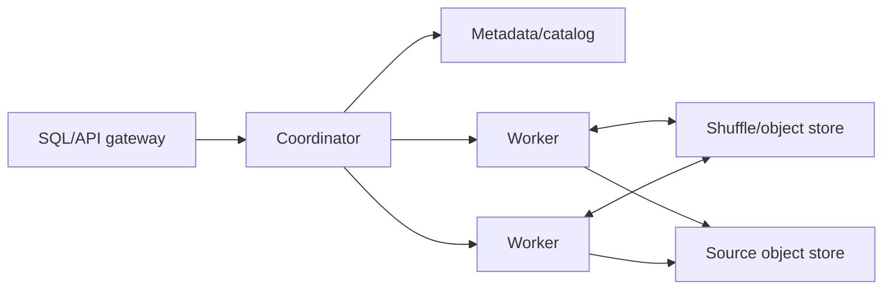

# From prototype to serious engine

The order matters: make semantics observable and memory-safe before adding machines. Each phase has an exit criterion so “distributed” does not become a vague forever-project.

## Phase 0 — current scrappy prototype

Delivered seams:

- Arrow batch ABI
- SQL-to-logical-to-physical pipeline
- Rule optimizer
- Bounded asynchronous operators
- CSV/Parquet/memory providers
- Aggregation, sorting, inner/left hash join
- Two-stage local distributed aggregation
- Plan text, metrics, tests, and Criterion harness

Exit criterion: the repository compiles on a configured Rust host and the checked-in correctness/benchmark suites pass. Machine-level toolchain verification remains the first maintainer action.

## Phase 1 — correctness and engine contracts

In progress: qualified name scopes and ambiguity errors, primitive `CAST`, SQL three-valued
Boolean/`NULL` behavior, `IS NULL`, expression normalization/constant folding,
native/distributed parity coverage, deterministic physical operator IDs with output/timing metrics,
a cooperative query-wide cancellation token, and the published
[SQL support matrix](SQL_SUPPORT.md) are now implemented. Golden explain-plan snapshots and a
DuckDB differential corpus cover the current core query shapes. Richer types, broader SQLLogicTest
coverage, logical plan IDs, and deeper metrics remain open.

Implement:

- SQL name scopes, ambiguity detection, casts, NULL three-valued logic, and coercion matrix
- Decimal, date, timestamp, binary, dictionary, list, and struct types
- Expression normalization, constant folding, boolean simplification, and null propagation
- Additional joins, set operations, window functions, CTEs, subqueries, and richer `HAVING`
- Property tests comparing native and distributed results
- SQLLogicTest corpus and differential tests against DuckDB
- Stable plan/operator IDs and per-operator metrics

Exit criterion: a published supported-SQL matrix, deterministic results, and a differential suite with no unexplained mismatches.

## Phase 2 — memory and local performance

In progress: the query-scoped reservation manager, configurable byte limit, typed exhaustion
error, peak-memory metric, and accounting for blocking native/distributed operators are
implemented. Ordered limits now lower to a physical Top-K operator with a paired full-sort
benchmark, and Parquet scans prune impossible row groups using footer statistics. Pressure
callbacks, spill files, bloom filters, and page pruning remain open. Native aggregation, hash join,
and distributed final merge now share encoded Arrow row keys instead of scalar-vector hash keys.

Implement:

- Query-scoped memory manager with reservations and pressure callbacks
- Spillable aggregate, join, sort, and shuffle files
- Streaming hash-join output and partitioned/radix hash tables
- Encoded group/join keys (implemented); dictionary-preserving key paths remain open
- Top-K operator for ordered limits (implemented; streaming input reduction remains open)
- Fused expression evaluation and reusable output buffers
- Parquet row-group statistics pruning (implemented); bloom/page pruning and reader predicates remain open
- Work-stealing scheduler and NUMA-aware partition sizing

Exit criterion: queries complete with inputs several times larger than RAM; memory never exceeds its configured envelope; local benchmark regressions are gated in CI.

## Phase 3 — cost-based planning

Implement:

- Table/column statistics, NDV, null fraction, min/max, and histograms
- Cardinality/selectivity estimation with confidence tracking
- Join-order search and broadcast-versus-shuffle choice
- Repartition/coalesce and exchange-aware physical properties
- Cost model for CPU, bytes read, bytes shuffled, and memory
- Adaptive feedback when runtime cardinality diverges from estimates

Exit criterion: the optimizer chooses explainable plans and improves a representative decision-support suite over fixed heuristics.

## Phase 4 — real distributed runtime

Foundation: versioned Serde contracts now cover stage fragments, worker registration and
heartbeats, task attempts and leases, cancellation, task states, and immutable shuffle-block
metadata. Distributed partial batches now cross a query-scoped loopback Arrow Flight/gRPC
transport. Versioned Protobuf fragments now encode every current physical operator and expression;
workers resolve scans through their catalog and validate the embedded Arrow contract before running.
An in-memory coordinator now enforces worker resources, heartbeat timeouts, dependency-aware
scheduling, task leases, bounded attempts, ownership, output-block retention, and cancellation.
The local cluster now drives real queries through coordinator assignments and worker task updates.
An Arrow Flight `DoAction` control service now transports stage submission, registration, heartbeats,
worker-specific assignment polling, task updates, and cancellation over gRPC. A standalone worker
runtime now executes leased plan fragments against its own catalog, heartbeats during concurrent
work, and acknowledges cancellation. A standalone coordinator executable hosts the same state and
control service with configurable deadlines and limits. Remote workers now retain bounded Arrow output
behind Flight `DoPut`/`DoGet`, report owner/endpoint/ticket/checksum manifests, and support verified
download and explicit deletion. A driver-side runner now submits one pre-fragmented stage, observes
stage/partition status, propagates timeout/cancellation, and collects verified output. Session-level
remote graph fragmentation/merge, repartitioned exchange, and
durable shuffle remain open.

Split the current `LocalCluster` seam into:

Implement:

- Protobuf plan fragments and Arrow Flight/gRPC batch transport (implemented in the local-cluster path)
- Worker registration, resources, heartbeat, leases, and task attempts (state machine, local runner, and Flight RPC transport implemented)
- Exchange partitioning, backpressure, checksums (worker output implemented), and durable/recomputable blocks
- Query cancellation and deadlines propagated to every task
- Retry policy with idempotent stage output commits
- Broadcast and hash-shuffle joins; range-partitioned global sort
- Locality-aware scheduling and autoscaling signals

Exit criterion: multi-host TPC-H subset runs correctly under worker loss, cancellation, skew, and constrained memory.

## Phase 5 — table ecosystem and production operations

Implement:

- S3/GCS/Azure object stores with range reads and credential providers
- Hive, Iceberg, Delta, and catalog integrations
- Snapshot isolation and partition/file pruning
- Flight SQL or PostgreSQL wire endpoint
- Structured logs, traces, profiles, dashboards, and query history
- Admission control, quotas, tenant isolation, TLS, RBAC, and audit events
- Plan/version compatibility and rolling upgrades

Exit criterion: repeatable deployment, security review, SLOs, runbooks, and recovery drills.

## Architecture decisions to preserve

- Keep storage behind `TableProvider` and transport behind a separate exchange interface.
- Keep logical semantics independent from execution placement.
- Keep immutable, serializable plans and explicit schemas.
- Make every unbounded structure participate in the memory manager.
- Treat metrics and correctness checks as part of operator APIs.
- Prefer recomputable immutable shuffle blocks over shared mutable state.

## Suggested first ten pull requests

1. Add CI on Linux, Windows, and macOS and make all current tests green.
2. Add SQLLogicTest plus golden explain-plan snapshots.
3. Fix ambiguity/scoping and implement complete NULL boolean semantics.
4. Add per-operator metrics and query cancellation tokens.
5. Introduce a memory reservation interface and account all hash tables.
6. Replace row-wise scalar hash keys with encoded Arrow key buffers. (Implemented.)
7. Implement top-K and benchmark it against full sort plus limit. (Implemented.)
8. Push Parquet row-group predicates using statistics. (Implemented.)
9. Define serializable stage/partition/task protocol types. (Implemented.)
10. Replace the memory exchange with a loopback Flight transport before testing multiple hosts. (Implemented.)
